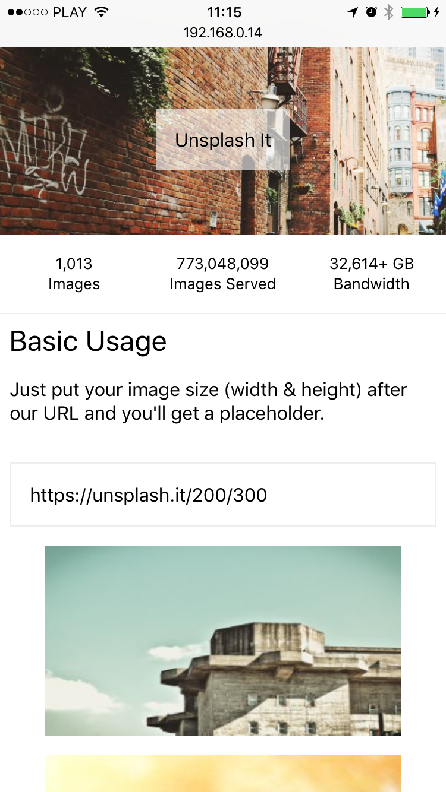

# just-box

[](https://travis-ci.org/RafalFilipek/just-box)
[](https://codecov.io/gh/RafalFilipek/just-box)

Just-Box helps you create universal layouts in your [React](https://facebook.github.io/react) and [React-Native](https://facebook.github.io/react-native) apps. It's based on [Daniel Steigerwald idea](https://medium.com/@steida?source=post_header_lockup) implemented in [este](https://github.com/este/este) boilerplate. `just-box` is a less opinionated standalone version with some additions and tweaks.

| web | ios | android |
|:---:|:---:|:-------:|
||||


## Installation

```shell
yarn add just-box

// or

npm install -S just-box
```

## Setup

Before you start creating layouts you have to answer two questions.

1.  `px`  or `rem` units as a default.
2. If you will use `rem` unit, what is base font size?

Now you have to configure `just-box`. To do this you will use a special `Box` called `ConfigBox`.

**WEB**

```jsx
import { ConfigBox } from 'just-box';

const App = ({ children }) => (
  <ConfigBox unit="rem" baseSize={16} box="div" text="span">
    {children}
  </ConfigBox>
)
```

**NATIVE**

```jsx
import { ConfigBox, nativeRenderer } from 'just-box';

const App = ({ children }) => (
  <ConfigBox unit="rem" baseSize={16} box={View} text={Text} felaRenderer={nativeRenderer}>
    {children}
  </ConfigBox>
)
```

You may have noticed `box` and `text` props. These are actual HTML tags / React Components that `just-box` will use.

You also need a `style` tag in you document. If you don't want to play with custom mount nodes and stuff just add in a `head` section of your document:

```html
<style id="stylesheet"></style>
```

### What about React Native?

Right. I said

> "(…) you create universal layouts (…)"

In fact all you have to do is change `box` and `text` props while there are no HTML tags in React Native.

```jsx
import { View, Text } from 'react-native';

//...

<ConfigBox unit="rem" baseSize={16} box={View} text={Text}>
```

**Yes**! You **can** use `rem` units in react-native.

## Usage

Ok, lets talk about `Box` component.

```jsx
import { Box } from 'just-box';
```

When you're building new applications you care about two things: `layout` and `styles`. `just-box` will help you with both aspects but it's focused on `layout`. That's why `Box` component has ~50 props that you probably use to create layouts. That's why you can write something like:

```jsx
<Box margin={1} paddingBottom={.5} position="absolute">{/*...*/}</Box>
```

This box will have `margin="1rem"`, `padding-bottom=.5rem` and `position=absolute`.

So, for example, to create two boxes in one line you can write:

```jsx
<Box display="flex" flexDirection="row">
  <Box flex={1}>Hello</Box>
  <Box flex={1}>World</Box>
</Box>
```

You can find full list of supported props in `Box.js` file.

How does it works? Every prop will be converted into a CSS class with [fela](http://fela.js.org). You don't have to think about it at all. In web classes will be reused. In React Native stuff will work like normal styles.

### Styles (inline styles)

Ok, you can set around 50 layout related props but what about styles. Well, there is a `style` prop but it does not work like a regular `style` attribute. `just-box` uses [fela](http://fela.js.org) to create CSS. I've decided that styles will be converted into css-classes just like other props.

```jsx
<Box margin={1} style={{ backgroundColor: 'red' }} />
```

Will **not** generate style attribute. You will get some some classes generated with fela.

But this approach it not good in some cases. For example [reactvirtualized](https://reactvirtualized.com) must set up some styles to work. But still, those elements are just Boxes. Thats why `just-box` introduces concept of `isotope`.

You may remember this word from chemistry.

> Isotopes are variants of a particular [chemical element](https://en.wikipedia.org/wiki/Chemical_element) which differ in [neutron number](https://en.wikipedia.org/wiki/Neutron_number).

In meme world you will define *isotopes* with:


With this knowledge:

```jsx
<Box
  margin={1}
  padding={Math.random()}
  style={{
    backgroundColor: 'red',
    opacity: Math.random(),
  }}
  isotope={['padding', 'opacity']}
 />
```

You will get something like:

```css
.a { margin: 1rem }
.b { background-color: red }
```

and

```js
style = {
  opacity: 0.234561,
  padding: 0.765432,
}
```

There are few things to remember.

1. `style` is more important than `props`

2. if `key` exists in `props` and `style` it will be *removed* from `props`

   ```jsx
   <Box padding={1} style={{ padding: 2 }} />

   // this will create only
   //	.a { padding: 2rem }
   // instead of
   // .a { padding: 1rem }
   // .b { padding: 2rem }
   ```

3. if `key` exists in `isotope` array it will be *removed* from `props` and `styles`

### Text

There is another component in `just-box` - `Text` . But `Text` is just a `Box` with some additional props. You can find them in `Text.js` file. `Text` is quite Important in case you're creating web + native app. In react-native you always have to wrap string with `Text` component.

```jsx
import { Box, Text } from 'just-box';

() => App ({ children }) => (
	<Box margin={1}>
  		<Text fontSize={1} color="blue" padding={.5}>Hello</Text>
  	</Box>
)
```

### Units

You can user `rem` or `px` as a default unit. But there are cases where `px` are required.

```jsx
<Box borderWidth={1} {...props} />
```

If your default unit is `rem` you will get `16px` border. What should yo do?

**Web + Native solution**

You can use `unit` function.

```jsx
import { unit } from 'just-box';

// default unit is `rem` & baseSize is 16

const i = unit(1)
```

Now what can you do with `i`.

`i.px` will return `1px` in web and `1` (number) in native

`i.rem` will return `1rem` in web and `16` (number) in native

`i.v` will return `1`(number) in web and `1`(number) in native

So in case you're using `rem` and you want `1px` you can write:


```jsx
<Box borderWidth={unit(1).px} {...props} />
```

**Web solution**

Just write `1px` as a string and you're all set.

### Platform specific styles

We would like universal components, but there are style implementations that not the same. In react native we have `marginVertical` or `paddingHorizontal`. There is this `display` CSS rulethat is not supported in native.

`just-box` has simple utility for that. It converts, omit, or change platform specific rules (`web` -> `native` and `native` -> `web`). It's not perfect, and quite small, but good for a start.

You can always deal with these types of styles on your own.

```jsx
// Button.js
export default ({ children }) => (
	<Box paddingHorizontal={1}>{children}</Box>
)
// Button.web.js
export default ({ children }) => (
	<Button paddingLeft={1} paddingRight={1}>{children}</Button>
)

```

### Custom Box ,`as` prop

In case you want to use a custom component as a `Box` (or `Text`) you can use `as` prop. It accepts string or Component. All you have to do is accept `className` and `style` prop from `Box` component.

```jsx
<Box as="section" padding={1}>Hello</Box>
<Text as={MegaText}>Hello</Text>
```

### FlexBox

FlexBox is cool. So I decided to add `FlexBox` component into `just-box`. It works just like nomal `Box` but it has some extra props. You will find all of them in `FlexBox.js` file.

```jsx
<ConfigBox unit="rem" baseSize={16} box="div" text="span">
  <FlexBox row>
    <FlexBox f1 column>
      <FlexBox justifyEnd>just</FlexBox>
      <FlexBox padding={1}>box</FlexBox>
    </FlexBox>
    <FlexBox f2>World</FlexBox>
    <FlexBox f1>!</FlexBox>
  </FlexBox>
</ConfigBox>
```

`f1` and `f2` are just shortcuts for `flex=1` and `flex=2`. You have also `f3` and `f4`.

### ConfigBox

Lets back to `ConfigBox`. Here are all the props you can set:

**`unit`** - `rem` or `px`. `rem` by default

**`baseSize`** - default `16`

**`box`** - `Box` component. In 99% of cases should be `"div"` in web and `View` in Native.

**`text`** - `Text` component. In 99% of cases should be `"span"` in web and `Text` in Native.

**`defaultBoxStyles`** - you can provide some default styles for all `Boxes` (but not `Text`). It might be useful to mimic React-Native default styles:

```js
const styles = {
  display: 'flex',
  position: 'relative',
  flexDirection: 'column',
};
```

**`defaultTextstyles`** - ^ but for `Text`

**`renderer`** - custom fela rendered object. By default `just-box` uses fela with two plugins `fela-plugin-prefixer` and `fela-plugin-fallback-value`. You can also import `defaultFelaRenderer` from 'just-box' in your app to set up, for example server-side rendering. After that just pass it with this prop.

**`getFelaMountNode`** - valid only for Web. Fela has to render styles somewhere. So it requires a `style` tag. You can provide a custom function for that.
